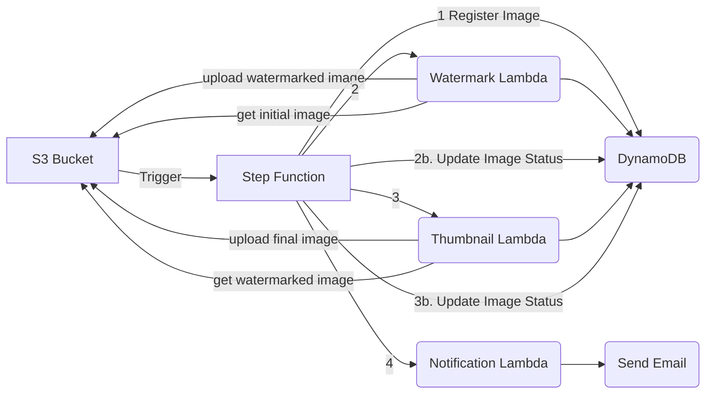
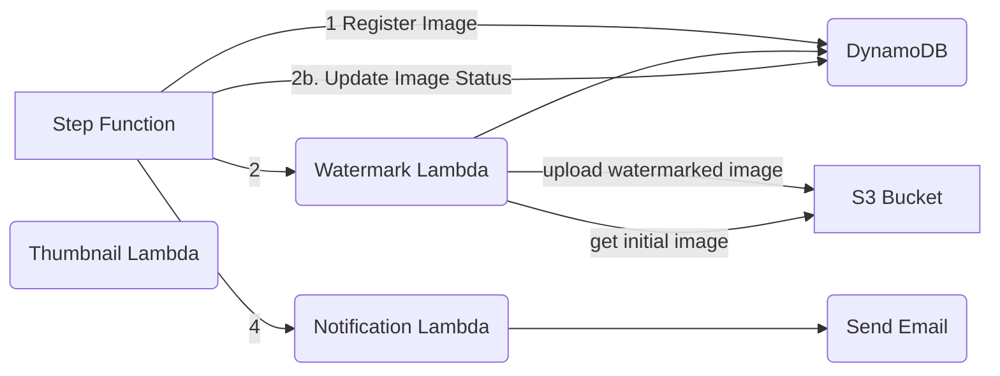
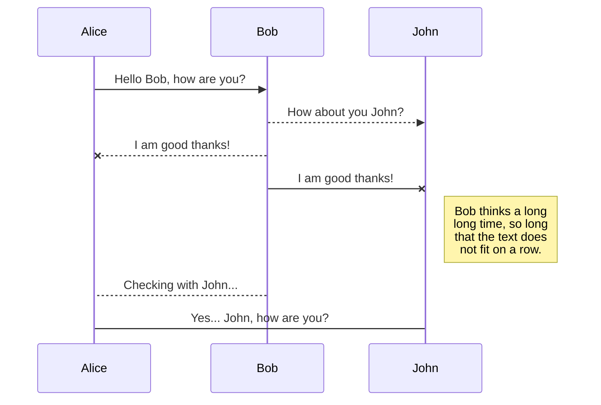
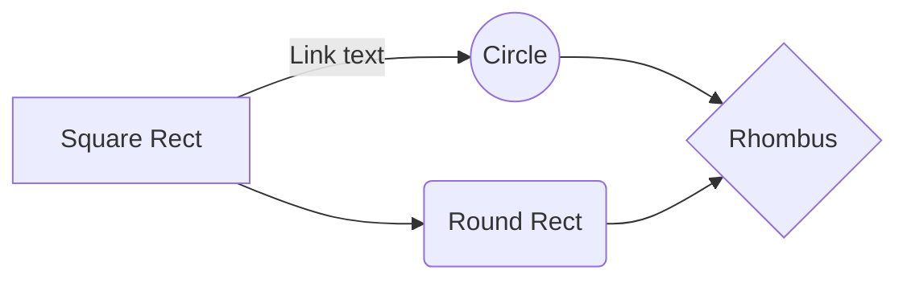

# Serverless Image Processing Workshop

>Hands-on Lab Guide (30 minutes)

### Final Architecture Diagram


### Initial Architecture Diagram

### Step 0: Connect to AWS Console  (5 minutes)
1. Get  your aws credentials  ready
2. Go to [Exteam AWS SSO Login](https://exteam.awsapps.com/start)
3. Log in with given credentials
4. Go to Account Tab, expend exteam-sbx* account and click to AdministratorAccess role


### Step 1: Explore Existing Resources (5 minutes)

#### 1. Check S3 Bucket:
We are expecting the xtm-serverless-lab-images* bucket

> Using Console 
>	- Search for S3 in the header bar
>	- Go to S3 Service > General purpose buckets Tab

> Using AWS Cli
>	```bash
>	aws s3 ls --profile lab
>	```	
#### 2. Check Step function
We are expecting the ImageProcessingStateMachine-* state machine
It orchestrate the call to services:
> RegisterImage (Dynamodb) >> Watermark Lambda >> Update Status (DynamoDB) >> Notification Lambda

> Using Console 
>	- Search for Step Function  in the header bar
>	- Go to Step Function Service >    State machines

>Using AWS Cli
>	```bash
>	aws stepfunctions list-state-machines --profile lab
>	```	 
#### 3. Check Dynamo DB Table 
 We are expecting the serverless-lab-images table
> Using Console 
>	- Search for DynamoDB in the header bar
>	- Go to Lambda  Service >  Tables
	
> Using AWS Cli
>	```bash
>	aws lambda list-functions --profile lab
>	```	
#### 4. Check Lambda Functions
We are expecting the following function:
- Watermark Lambda
- Thumbnail Lambda
- Notification Lambda

> Using Console 
>	- Search for Lambda in the header bar
>	- Go to Lambda  Service >    Functions
	
> Using AWS Cli
>	```bash
>	aws lambda list-functions --profile lab
>	```	 

### Step 2: Complete Code of  Lambda Functions (10 minutes)
 
#### Watermark Lambda:
Objective: Add code to lambda
- In S3 Service go to exteam-sbx?-labs/serverless/watermark-function.zip and copy object url
- In the console go to Lambda Service > Functions > watermark lambda > Code 
- Upload From S3 Location : Paste object url
- Test with as payload:
```json
 {"object_key": "test.jpg"}
 ```
- Go to S3 bucket serverless-lab-sbx1-images/wm to check the image result
- Go to DynamoDB to check the Status

Lambda Code:
```python
import boto3
import os
import json
from PIL import Image, ImageDraw, ImageFont
import io
import logging

# Configure logging
logger = logging.getLogger()
logger.setLevel(logging.INFO)

# Initialize S3 client
s3_client = boto3.client('s3')
bucket_name = os.environ['IMAGE_BUCKET']

def handler(event, context):
    """
    Lambda function that adds a watermark to an image from S3 and saves it back to S3.
    
    Args:
        event: The event dict containing the S3 bucket and key information
        context: The context object provided by AWS Lambda
        
    Returns:
        dict: The original input with an added watermarked_image_key field
    """
    try:
        logger.info(f"Received event: {json.dumps(event)}")
        
        # Extract bucket and key information from the event
        if 'Records' in event:
            # S3 event trigger
            key = event['Records'][0]['s3']['object_key']
            input_event = event
        else:
            # Direct invocation
            key = event.get('object_key')
            input_event = event
            
            if not bucket_name or not key:
                raise ValueError("Missing required parameters: bucket and key")
        
        # Skip processing if the image is already in the wm folder
        if key.startswith('wm/'):
            logger.info(f"Image {key} is already in wm folder. Skipping processing.")
            return {
                **input_event,
                "watermarked_image_key": key
            }
        
        # Download the image from S3
        logger.info(f"Downloading image {key} from bucket {bucket_name}")
        response = s3_client.get_object(Bucket=bucket_name, Key=key)
        image_content = response['Body'].read()
        
        # Get the content type
        content_type = response.get('ContentType', 'image/jpeg')
        
        # Open the image using PIL
        image = Image.open(io.BytesIO(image_content))
        
        # Create a drawing context
        draw = ImageDraw.Draw(image)
        
        # Try to use a built-in font
        try:
            # For Lambda, we'll use the default font
            font = ImageFont.load_default()
            font_size = 40
            
            # For larger watermark text, create a larger default font
            large_font = ImageFont.load_default()
        except IOError:
            logger.warning("Could not load font, using default")
            font = ImageFont.load_default()
            large_font = font
            font_size = 20
        
        # Add the watermark
        text = "Exteam Meet UP Day 03/07/2025"
        
        # Get image dimensions
        width, height = image.size
        
        # Calculate text size and position (bottom right corner)
        # For newer Pillow versions
        try:
            textwidth, textheight = draw.textsize(text, font=large_font)
        except AttributeError:
            # For newer Pillow versions
            textwidth, textheight = large_font.getbbox(text)[2:]
        
        x = width - textwidth - 20
        y = height - textheight - 20
        
        # Add semi-transparent white text
        draw.text((x, y), text, font=large_font, fill=(255, 255, 255, 180))
        
        # Add shadow effect for better visibility
        draw.text((x+2, y+2), text, font=large_font, fill=(0, 0, 0, 180))
        
        # Save the watermarked image to a buffer
        buffer = io.BytesIO()
        
        # Preserve the original format
        save_format = image.format if image.format else 'JPEG'
        
        # Save with original quality if it's a JPEG
        if save_format == 'JPEG':
            image.save(buffer, format=save_format, quality=95)
        else:
            image.save(buffer, format=save_format)
            
        buffer.seek(0)
        
        # Create the watermarked image key
        filename = os.path.basename(key)
        watermarked_key = f"wm/{filename}"
        
        logger.info(f"Uploading watermarked image to {watermarked_key}")
        
        # Upload the watermarked image to S3
        s3_client.put_object(
            Bucket=bucket_name, 
            Key=watermarked_key, 
            Body=buffer,
            ContentType=content_type
        )
        
        # Return the input with the added watermarked image key
        result = {
            **input_event,
            "watermarked_image_key": watermarked_key
        }
        
        logger.info(f"Processing complete. Result: {json.dumps(result)}")
        return result
        
    except Exception as e:
        logger.error(f"Error processing image: {str(e)}")
        raise

```

#### Notification Lambda (Python):
```python
import boto3
import os
from botocore.exceptions import ClientError

# Get environment variables
bucket_name = os.environ['IMAGE_BUCKET']
email_recipient = os.environ['EMAIL_RECIPIENT']

# Initialize S3  client
s3_client = boto3.client('s3')
# Initialize SES client
# Create an STS client
sts_client = boto3.client('sts')

# Assume the role
assumed_role = sts_client.assume_role(
    RoleArn='arn:aws:iam::600157662215:role/SendEmailRole',
    RoleSessionName='LambdaCrossAccountSession'
)

# Get temporary credentials
credentials = assumed_role['Credentials']

# Create a new SES client using the assumed role credentials
ses_client = boto3.client(
    'ses',
    aws_access_key_id=credentials['AccessKeyId'],
    aws_secret_access_key=credentials['SecretAccessKey'],
    aws_session_token=credentials['SessionToken'],
    region_name='eu-west-3'
)

def handler(event, context):

    # Get object key from event or use default
    object_key = event.get('object_key', 'default-image.jpg')

    # Generate presigned URL
    try:
        presigned_url = s3_client.generate_presigned_url(
            'get_object',
            Params={'Bucket': bucket_name, 'Key': object_key},
            ExpiresIn=3600  # URL expires in 1 hour
        )
        print(f"Presigned URL generated: {presigned_url}")
    except ClientError as e:
        print(f"Error generating presigned URL: {e}")
        return {
            'statusCode': 500,
            'body': 'Error generating presigned URL'
        }

    # Send email
    try:
        sender_email = os.environ.get('SENDER_EMAIL', 'aws+lab@exteam.fr')

        ses_client.send_email(
            Source=sender_email,  # Must be verified in SES
            Destination={
                'ToAddresses': [email_recipient]
            },
            Message={
                'Subject': {
                    'Data': 'Your S3 Object Access Link'
                },
                'Body': {
                    'Text': {
                        'Data': f'Here is your secure link to access the requested file: {presigned_url}\n\nThis link will expire in 1 hour.'
                    },
                    'Html': {
                        'Data': f'''
                        <html>
                        <body>
                            <h2>Your Requested File</h2>
                            <p>Here is your secure link to access the requested file:</p>
                            <p><a href="{presigned_url}">Click here to view/download</a></p>
                            <p><i>This link will expire in 1 hour.</i></p>
                        </body>
                        </html>
                        '''
                    }
                }
            }
        )
        print(f"Email sent successfully to {email_recipient}")
    except ClientError as e:
        print(f"Error sending email: {e}")
        return {
            'statusCode': 500,
            'body': 'Error sending email'
        }

    return {
        'statusCode': 200,
        'body': 'Presigned URL generated and sent successfully'
    }

```

### Step 3: Test Step Function (10 minutes)
Test step function with input 
```json
{"object_key": "start/test.jpg"}
```

Step function template:
```json
{
  "StartAt": "Pass",
  "States": {
    "Pass": {
      "Type": "Pass",
      "Next": "DynamoDB PutItem",
      "Assign": {
        "object_key.$": "$.object_key",
        "imageId.$": "$$.Execution.Name"
      },
      "Parameters": {
        "object_key.$": "$.object_key",
        "imageId.$": "$$.Execution.Name"
      }
    },
    "DynamoDB PutItem": {
      "Type": "Task",
      "Resource": "arn:aws:states:::dynamodb:putItem",
      "Parameters": {
        "TableName": "serverless-lab-images",
        "Item": {
          "imageId": {
            "S.$": "$$.Execution.Name"
          },
          "object_key.$": "$.object_key",
          "process_status": "REGISTERED"
        }
      },
      "Next": "WatermarkImage",
      "ResultPath": "$.dynamodbResult"
    },
    "WatermarkImage": {
      "Type": "Task",
      "Resource": "arn:aws:lambda:eu-west-3:752460275474:function:serverless-lab-WatermarkFunction-fHSvHU1HkKYv",
      "Next": "DynamoDB UpdateItem",
      "ResultPath": null
    },
    "DynamoDB UpdateItem": {
      "Type": "Task",
      "Resource": "arn:aws:states:::dynamodb:updateItem",
      "Parameters": {
        "TableName": "serverless-lab-images",
        "Key": {
          "imageId": {
            "S.$": "$.imageId"
          }
        },
        "UpdateExpression": "SET process_status = :new_status",
        "ExpressionAttributeValues": {
          ":new_status": {
            "S": "WATERMARKED"
          }
        }
      },
      "Next": "SendNotification"
    },
    "SendNotification": {
      "Type": "Task",
      "Resource": "arn:aws:lambda:eu-west-3:752460275474:function:serverless-lab-NotifyFunction-Y7ntea9nAAS0",
      "End": true
    }
  }
}
```
### Step 4: Trigger Step function from S3
**Using Lambda**


**Using Event Bridge**
Follow AWS tutorial https://docs.aws.amazon.com/step-functions/latest/dg/tutorial-cloudwatch-events-s3.html
__Bucket__: serverless-lab-sbx?-images
__Step function__: ImageProcessingStateMachine-*

### Step 5: Testing (5 minutes)

1. Upload test image:
```bash
aws s3 cp test-image.jpg s3://your-bucket-name/start
```

2. Monitor Step Function execution:
- Check AWS Console
- Verify DynamoDB entries
- Check email receipt

### Success Criteria
- Image uploaded to S3
- Watermark applied
- Thumbnail created
- Email received with presigned URL
- All statuses updated in DynamoDB

### Common Issues and Troubleshooting
- IAM permissions
- Lambda timeouts
- S3 event configuration
- Step Function error handling

This lab guide provides a practical, hands-on experience while meeting the time constraints and complexity requirements for beginners.# ServerlessWorkshop


# Markdown extensions

StackEdit extends the standard Markdown syntax by adding extra **Markdown extensions**, providing you with some nice features.

> **ProTip:** You can disable any **Markdown extension** in the **File properties** dialog.


## SmartyPants

SmartyPants converts ASCII punctuation characters into "smart" typographic punctuation HTML entities. For example:

|                |ASCII                          |HTML                         |
|----------------|-------------------------------|-----------------------------|
|Single backticks|`'Isn't this fun?'`            |'Isn't this fun?'            |
|Quotes          |`"Isn't this fun?"`            |"Isn't this fun?"            |
|Dashes          |`-- is en-dash, --- is em-dash`|-- is en-dash, --- is em-dash|


## KaTeX

You can render LaTeX mathematical expressions using [KaTeX](https://khan.github.io/KaTeX/):

The *Gamma function* satisfying $\Gamma(n) = (n-1)!\quad\forall n\in\mathbb N$ is via the Euler integral

$$
\Gamma(z) = \int_0^\infty t^{z-1}e^{-t}dt\,.
$$

> You can find more information about **LaTeX** mathematical expressions [here](http://meta.math.stackexchange.com/questions/5020/mathjax-basic-tutorial-and-quick-reference).


## UML diagrams

You can render UML diagrams using [Mermaid](https://mermaidjs.github.io/). For example, this will produce a sequence diagram:



And this will produce a flow chart:


